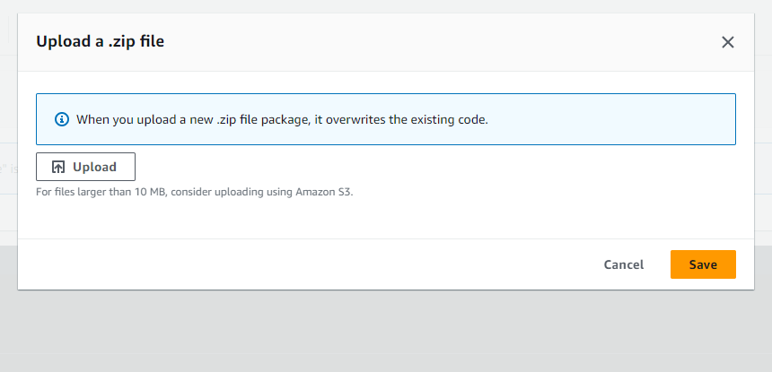

# **File Transaction Processor**


## **Table of Contents**
- [Overview](#overview)
- [Architecture](#architecture)
- [Features](#features)
- [Installation](#installation)
- [Testing](#testing)
- [Deployment](#deployment)
- [Environment Variables](#environment-variables)

---

## **Overview**

**File Transaction Processor** is a high-performance, serverless application developed in Go for processing file-based transactions. It leverages AWS Lambda for scalable event-driven architecture.

This project follows best practices for Go development, is optimized for concurrency, and handles real-time transaction processing with enhanced logging and error handling.

---

## **Architecture**

The architecture of this project follows a serverless pattern using AWS Lambda, enabling on-demand scaling and minimal infrastructure management.

```
                    +------------------------+
                    |    AWS Lambda (Go)     |
                    |    - Read csvs         |
                    |    - Persist info      |
                    |    - Notify users      |
                    +-----------+------------+
```

- **AWS Lambda (Go):** Core processing logic written in Go for handling high-volume transactions with concurrency support.
---

## **Features**

- **File Transaction Processing**: Efficiently processes files, such as CSVs, and transforms data.
- **Concurrency**: Leverages Go’s goroutines for concurrent data processing.
- **Error Handling & Logging**: Built-in logging using `zap` and error handling for robust operation.
- **Email Notifications**: Sends notifications using an SMTP service.
- **Configurable**: Easily configurable using environment variables.

---

## **Installation**

### Prerequisites

Ensure you have the following installed:

- [Go 1.23.1](https://golang.org/dl/)
- [Docker](https://www.docker.com/)
- [Podman](https://podman.io/) 

### Steps

1. **Clone the Repository:**
   ```bash
   git clone https://github.com/Jhooomn/file-transaction-processor.git
   cd file-transaction-processor
   ```

2. **Install Dependencies:**
   This project uses Go modules. Ensure you are in the project root and run:
   ```bash
   make local_pipeline
   ```

---

## **Environment Variables**

The following environment variables are required for proper configuration of the Lambda function:

| Variable      | Description                                  | Example                          |
| ------------- | -------------------------------------------- | -------------------------------- |
| `_LAMBDA_SERVER_PORT` | Port for Lambda server              | `8080`                           |
| `AWS_LAMBDA_RUNTIME_API` | Lambda runtime API endpoint     | `localhost:8080`                 |
| `DATA_PATH`   | Path to the input data files (e.g., CSVs)    | `/mnt/d/project/file/data/`      |
| `DB_NAME`     | Name of the database                        | `random-db-name`                 |
| `DB_USER`     | Database username                           | `randomuser`                     |
| `DB_PSW`      | Database password                           | `randompassword123`              |
| `DB_DOMAIN`   | Database domain                             | `random-db-domain.mongodb.net`   |
| `DEFAULT_NAME`| Default name used in the app                | `RandomName`                     |
| `DEFAULT_EMAIL`| Default email address                      | `randomname@example.com`         |
| `SMTP_PSW`    | SMTP server password                         | `randomsmptpassword`             |
| `SMTP_SERVER` | SMTP server address                          | `smtp.random.com:587`            |
| `SMTP_FROM`   | Email address used for sending notifications | `randomname@example.com`         |
| `ENVIRONMENT`   | Defines the enviroment which is running this lambda/container | `local`         |


---


## **Testing**

This project includes unit tests and integration tests to ensure functionality. Mocking is handled via the `mockery` package.

### Running Tests
```bash
make test
```
---

## **Deployment**

### Using Podman or Docker


1. **Build the Image:**
   Run the following command to build the image using podman or docker:
   ```bash
   podman build -t file-transaction-processor .
   docker build -t file-transaction-processor .
   ```

2. **Deploy the Container:**
   After the image building, you can deploy your container locally with these commands:
   ```bash
   podman run -p 8080:8080 --env-file=.env file-transaction-processor
   docker run -p 8080:8080 --env-file=.env file-transaction-processor
   ```

### Using AWS 

1. **Build the function:**
   Run the following command to build the .zip with all the info needed:
   ```bash
   make build
   ```
2. **Upload the .zip file to the lambda service**


3. **Invoke the function using AWS CLI**
   Run the following command to trigger the lambda in the cloud env:
   ```bash
    aws lambda invoke --function-name gosimple --payload fileb://payload.json lambda.out 
   ```